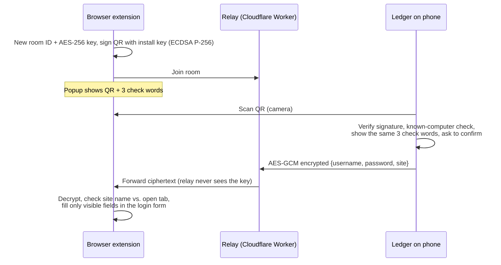

<p align="center">
  <picture>
    <source media="(prefers-color-scheme: dark)" srcset="docs/images/ledger-logo-dark.svg">
    
  </picture>
</p>

# Ledger

**An offline-first Android password manager that can fill logins on any computer by scanning a QR code, without typing and without an account.**


-3DDC84)


Ledger keeps your logins and 2FA codes encrypted on your phone. When you need a password on a computer you don't own, like a library PC, a work laptop or a friend's machine, open the Ledger browser extension and scan its QR code with your phone. The login travels end-to-end encrypted and is filled into the page. Nothing is stored on the computer, and the relay in between only ever sees ciphertext.

> **Status:** personal portfolio project. It has had a thorough self-review ([docs/SECURITY_PLAN.md](docs/SECURITY_PLAN.md)) but **no independent security audit**. Don't trust it with anything you can't afford to lose.

<!-- Screenshots: add images to docs/images/ and uncomment.
<p align="center">
  
  
  
</p>
-->

## Features

- **Encrypted vault:** every password is encrypted with AES-256-GCM using a key held in the Android Keystore.
- **Unlock** with fingerprint or a PIN. The PIN is hashed with PBKDF2 and a random salt, with a lockout that can't be skipped by changing the clock.
- **Auto-lock** covers every vault screen whenever the app leaves the foreground.
- **Duress PIN:** opens an empty decoy vault and leaves no trace in the unlock history.
- **2FA codes (TOTP):** a built-in authenticator, linked to your logins.
- **Android Autofill:** each suggestion needs a fingerprint or PIN, and the prompt names the app or site receiving the password.
- **Fill on computer:** scan the extension's QR code to fill a login in any Chromium browser.
- **Encrypted backups:** export and import, protected by a password (PBKDF2-HMAC-SHA256 with 600k iterations, then AES-GCM).
- **Password tools:** a generator, a strength meter, and a reused-password scan.
- **Hide screen contents:** blocks screenshots and blanks the recent-apps preview. On by default.

## How "Fill on computer" works



**Defences against a fake QR code on a phishing page:**
- **Signed QR.** Each extension install has its own non-extractable signing key, so a web page can't forge a QR code that looks like it came from your computer.
- **Known computers.** Once you tell the phone to remember a computer, a code from any other key shows up as a new computer instead of a trusted one.
- **Check words.** On a new computer, you compare three words on the phone with the words in the extension's toolbar popup, not with anything on the web page.

**Relay:**
- It has no API key.
- It forwards messages only within a 16-character random room.
- It accepts connections only from extensions or the app, not from web pages.
- It closes every room after 10 minutes.

**Extension:**
- It warns when the login's site doesn't match the open tab.
- It never fills hidden or decoy fields.

## Repository layout

| Path | What |
|------|------|
| `app/` | The Android app: Java, Material 3, Room, Android Keystore, BiometricPrompt, AutofillService. |
| `Extension-pass/` | The browser extension: Manifest V3, WebCrypto, with no build step. |
| `relay/` | The relay: a Cloudflare Worker plus Durable Objects. |
| `docs/` | Security review and fixes, UI redesign notes, and a manual test page. |

## Build and run

You need Android Studio (a recent version, with JDK 17 or newer), a device or emulator running Android 12 or newer, Node.js 18 or newer, and a free Cloudflare account for the relay.

### 1. Deploy the relay

```bash
cd relay
npx wrangler login
npx wrangler deploy        # prints https://ledger-relay.<your-account>.workers.dev
```

Details and limits are in [relay/README.md](relay/README.md).

### 2. Android app

1. Copy the `RELAY_URL` line from [`local.properties.example`](local.properties.example) into `local.properties`, using your relay address with `wss://`.
2. Open the project in Android Studio and run the `app` configuration, or build from the command line:

```bash
./gradlew assembleDebug
```

### 3. Browser extension

1. Copy `Extension-pass/config.example.js` to `Extension-pass/config.js` and set `RELAY_URL`.
2. Open `chrome://extensions`, turn on **Developer mode**, click **Load unpacked**, and choose `Extension-pass/`.
3. On a login page, click the Ledger toolbar icon and scan the QR code from the app with **Fill on computer**.

`local.properties` and `config.js` are git-ignored, so your relay address never gets committed.

## Tests

```bash
./gradlew testDebugUnitTest     # JVM unit tests: crypto, PIN hashing and lockout, QR signing, TOTP, autofill matching…
cd relay && npm test            # relay routing and limits
```

`docs/test-pages/fill-test.html` is a manual test page for the extension's hidden-field (honeypot) protection.

## Security

- The design, the issues found in review, and how each was fixed: [docs/SECURITY_PLAN.md](docs/SECURITY_PLAN.md).
- To report a vulnerability: [SECURITY.md](SECURITY.md).

## License

Ledger is free software under the [GNU General Public License v3.0](LICENSE). Third-party components and their licenses are listed in [THIRD_PARTY_NOTICES.md](THIRD_PARTY_NOTICES.md).
